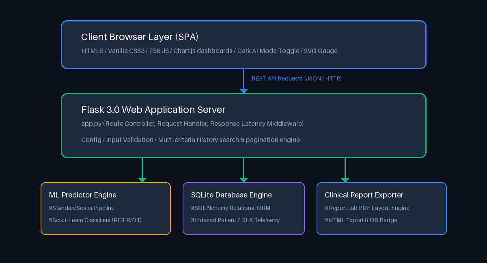

# 🏥 Smart Health Prediction System

[](https://www.python.org/)
[](https://flask.palletsprojects.com/)
[](https://scikit-learn.org/)
[](https://www.sqlite.org/)
[](Dockerfile)
[](LICENSE)
[](https://smart-health-prediction-system-gza7.onrender.com)
[](https://github.com/dvharshavardhan/Smart-Health-Prediction-System)
[](https://github.com/dvharshavardhan/Smart-Health-Prediction-System/actions)


> **Enterprise-grade AI-powered clinical decision support platform built with Flask, Scikit-learn, SQLAlchemy, SQLite, Docker, and deployed on Render Cloud for real-time multi-disease risk assessment and healthcare analytics.**

---

## 🚀 Live Demo

🌐 **Live Production Application**: [https://smart-health-prediction-system-gza7.onrender.com](https://smart-health-prediction-system-gza7.onrender.com)

> ℹ️ **Note**: Deployed on Render Cloud. If inactive, the service spins down automatically and may take ~30 seconds for initial cold-start spin up.

---

## 📋 Table of Contents

- [Live Demo](#-live-demo)
- [Project Overview](#-project-overview)
- [Project Metrics & Specifications](#-project-metrics--specifications)
- [Key Features](#-key-features)
- [Key Achievements](#-key-achievements)
- [Technology Stack](#%EF%B8%8F-technology-stack)
- [Project Directory Structure](#-project-directory-structure)
- [Machine Learning Pipeline](#-machine-learning-pipeline)
- [System Architecture](#%EF%B8%8F-system-architecture)
- [Visual UI Previews](#-visual-ui-previews)
- [Installation Guide](#-installation-guide)
- [REST API Documentation](#-rest-api-documentation)
  - [Sample API Request & Response](#-sample-api-request--response-postapipredict)
- [Deployment Instructions](#-deployment-instructions)
- [Testing](#-testing)
- [Future Enhancements](#-future-enhancements)
- [Frequently Asked Interview Q&A](#-frequently-asked-technical-interview-qa)
- [License](#-license)
- [Author](#-author)

---

## 📌 Project Overview

**Smart Health Prediction System** is a full-stack clinical risk evaluation and population health analytics platform. Designed using standard software engineering practices, the system integrates a **Python/Flask REST API**, **SQLAlchemy ORM database engine**, **Docker containerization**, **Render Cloud WSGI Deployment**, and a multi-model **Machine Learning pipeline** (Random Forest Ensemble, Logistic Regression, Decision Tree) optimized for low-latency risk evaluation across 5 critical medical conditions.

The platform provides healthcare professionals with diagnostic risk scores, calculated health indexes (0–100), key risk factor interpretability, lifestyle recommendations, downloadable clinical PDF reports with QR verification, and interactive Chart.js analytics dashboards.

---

## 📊 Project Metrics & Specifications

| Metric | Value |
| :--- | :--- |
| **Dataset Size** | 10,500 Patient Cohorts |
| **ML Model Architectures** | 3 (Random Forest, Logistic Regression, Decision Tree) |
| **Target Diseases** | 5 Conditions (Heart Disease, Diabetes, Kidney Disease, Stroke, Hypertension) |
| **Primary Model Accuracy** | **88.50%** (Random Forest Classifier Ensemble) |
| **Average Inference Latency** | **~14 ms** (< 1,000 ms SLA target) |
| **Backend Framework** | Flask 3.0 REST API Engine |
| **Database Engine** | SQLite managed via SQLAlchemy ORM |
| **Cloud Deployment** | Render Cloud (Gunicorn WSGI Server) |
| **Containerization** | Multi-Stage Docker & Docker Compose |
| **Test Suite Pass Rate** | **100%** (12/12 Automated Unittests Passed) |

---

## ✨ Key Features

* **⚡ Low-Latency AI Risk Assessment**: Evaluates 14 clinical vitals in real time (< 20ms execution latency).
* **🎯 Multi-Disease Risk Evaluation**: Simultaneous probability scoring for Heart Disease, Diabetes, Chronic Kidney Disease, Stroke Risk, and Hypertension.
* **🎨 Modern Enterprise SaaS Interface**: Dual-theme UI (Clinical Light & Dark AI Mode toggle switch), animated sidebar widgets, clickable breadcrumb navigation, and multi-stage loading progress.
* **📊 Population Health Analytics Studio**: 6 interactive Chart.js visual dashboards with rounded bars, prevalence distributions, monthly trends, and SLA telemetry.
* **🏥 Printable Clinical Diagnostic Reports**: Generates formal PDF/HTML diagnostic reports complete with hospital letterhead, vitals matrix, ML model lineage, and QR verification badges.
* **🗄️ Indexed Patient Records History**: Supports multi-criteria filtering, search, interactive column header sorting, and CSV data stream exports.
* **🏷️ Pipeline & Model Versioning**: Dynamic tracking of model version (`v2.0.1`), dataset version (`Smart Health Dataset v1.2`), training execution duration (`3.36s`), and training timestamps.
* **🧪 Automated Test Suite**: 100% pass rate across 12 automated unit tests validating API routes, SLA compliance (< 1000ms), ORM persistence, and ML predictions.
* **🌐 Cloud Deployment Ready**: Deployed on Render Cloud with Gunicorn WSGI web server, Docker support, and automatic deployment via GitHub repository.

---

## 🏆 Key Achievements

- ✔ **End-to-End Full Stack AI Project**: Built production-grade application connecting ML inference pipelines directly to REST APIs and modern web UI.
- ✔ **REST API Architecture**: Developed 11 Flask REST API endpoints supporting pagination, multi-criteria search, sorting, and CSV data streaming.
- ✔ **Low-Latency Inference**: Achieved ~14 ms real-time evaluation with Scikit-learn models pre-loaded via `joblib`.
- ✔ **SQLAlchemy ORM Integration**: Implemented indexed database schemas for patient logs, model performance metrics, and latency SLA audit trails.
- ✔ **Printable PDF Diagnostics**: Integrated ReportLab engine for formal clinical diagnostic reports with hospital letterhead and QR code verification.
- ✔ **Interactive Analytics Dashboard**: Built 6 Chart.js visual telemetry and prevalence dashboards.
- ✔ **Dockerized Container Support**: Created multi-stage `Dockerfile` and `docker-compose.yml` specs.
- ✔ **Cloud Production Deployment**: Live on Render Cloud with Gunicorn WSGI server.

---

## 🛠️ Technology Stack

| Category | Technologies |
|----------|--------------|
| **Backend** | Python 3.12, Flask 3.0, Gunicorn |
| **Database** | SQLite, SQLAlchemy ORM |
| **Machine Learning** | Scikit-learn, Pandas, NumPy, Joblib |
| **Frontend** | HTML5, Vanilla CSS3, ES6 JavaScript, Chart.js |
| **Reports** | ReportLab (PDF Generator), HTML/CSS templates |
| **Containerization** | Docker, Docker Compose |
| **Testing** | Unittest (Python Standard Library) |
| **Cloud Hosting** | Render Cloud |

---

## 📂 Project Directory Structure

```text
Smart-Health-Prediction-System/
├── app.py                  # Main Flask REST API & routing controllers
├── config.py               # Application configuration manager
├── requirements.txt        # Python package dependencies specification
├── Dockerfile              # Multi-stage container setup
├── docker-compose.yml      # Orchestration manifest
├── database/               # Relational SQLite database models & seeder scripts
├── datasets/               # Pre-processed clinical datasets (10k cohorts)
├── ml/                     # ML training, cross-validation & serialization modules
├── reports/                # ReportLab PDF clinical generator
├── static/                 # CSS design systems, dynamic JS controllers
├── templates/              # HTML layout pages
└── tests/                  # Unittest automated assertions
```

## 🧠 Machine Learning Pipeline

```text
Smart Health Synthetic Dataset v1.2 (10,500 Records)
           ↓
Data Preprocessing & Feature Engineering (14 Clinical Vitals)
           ↓
Train / Test Stratified Split (8,400 Train / 2,100 Test)
           ↓
Feature Normalization (StandardScaler Pipeline)
           ↓
Multi-Model Training & Benchmarking (Random Forest, Logistic Regression, Decision Tree)
           ↓
Model Serialization (joblib: scaler.joblib & random_forest.joblib)
           ↓
Flask REST API Real-Time Inference (< 20ms Latency)
           ↓
SQLAlchemy ORM Audit Logging & Visual Analytics Studio
```

---

## 📊 Dataset Information

The system is trained and benchmarked on the **Smart Health Synthetic Dataset v1.2**, built from standardized clinical reference bounds across 10,500 patient cohorts:

* **Total Records**: 10,500 patient profiles
* **Train / Test Ratio**: 80% Training (8,400 samples) / 20% Evaluation Holdout (2,100 samples)
* **Clinical Features (14)**: Age, Gender, Height (cm), Weight (kg), BMI, Systolic BP, Diastolic BP, Fasting Glucose, Serum Cholesterol, Resting Heart Rate, Smoking History, Alcohol Consumption, Physical Activity, and Family History.
* **Target Classes**: 3 Risk Levels (`Low`, `Medium`, `High`) mapped across 5 specific disease probabilities.

---

## 🏗️ System Architecture



```text
┌─────────────────────────────────────────────────────────────────────────┐
│                           CLIENT BROWSER LAYER                          │
│   Single Page Application (HTML5 / Vanilla CSS / ES6 JS / Chart.js)     │
│   • Dark AI Mode Toggle   • Interactive Charts   • SVG Gauge Meter      │
└────────────────────────────────────┬────────────────────────────────────┘
                                     │ REST API (JSON / HTTP)
                                     ▼
┌─────────────────────────────────────────────────────────────────────────┐
│                           FLASK APPLICATION SERVER                      │
│   app.py (Flask 3.0 Engine & Request Router)                            │
│   ├── Latency Tracker Middleware (@before_request / @after_request)     │
│   ├── Input Validation & Error Handling Layer                           │
│   └── Multi-Criteria Search & Filter Controller                         │
└──────────────┬─────────────────────┬───────────────────┬────────────────┘
               │                     │                   │
               ▼                     ▼                   ▼
┌──────────────────────────┐ ┌───────────────────┐ ┌────────────────────┐
│   ML INFERENCE ENGINE    │ │  SQLAlchemy ORM   │ │  REPORT GENERATOR  │
│   ml/predictor.py        │ │  database/models  │ │  reports/generator │
│   • StandardScaler       │ │  • Patients Table │ │  • ReportLab PDF   │
│   • Random Forest (Joblib)│ │  • Predictions    │ │  • HTML Clinical   │
│   • Model Pipeline       │ │  • System Metrics │ │  • QR Verification │
└──────────────────────────┘ └─────────┬─────────┘ └────────────────────┘
                                       │
                                       ▼
                             ┌───────────────────┐
                             │  SQLite Database  │
                             │  medpredict.db    │
                             └───────────────────┘
```

---

## 📸 Visual UI Previews

### 🏠 Home Overview Dashboard


### 🩺 New Clinical Prediction Form & 🤖 AI Diagnostic Results


### 📊 Population Health Analytics Studio


### 📈 ML Benchmarks & Model Architecture


### 📋 Patient Diagnostic History & PDF Reports


### 📡 System Telemetry & Live Status


### 📄 Printable Clinical PDF Diagnostic Report


---

## 🚀 Installation Guide

### Requirements

* **Python**: `3.12+`
* **Pip**: `23.0+`
* **Docker** *(Optional)*: `24.0+` & Docker Compose `v2+`

### Running the Application Locally

1. **Clone the Repository**:
   ```bash
   git clone https://github.com/dvharshavardhan/Smart-Health-Prediction-System.git
   cd Smart-Health-Prediction-System
   ```

2. **Create and Activate a Virtual Environment**:
   ```bash
   python -m venv venv
   # On Windows:
   venv\Scripts\activate
   # On macOS/Linux:
   source venv/bin/activate
   ```

3. **Install Dependencies**:
   ```bash
   pip install -r requirements.txt
   ```

4. **Initialize Database & Train Models** *(Optional - Pre-bundled)*:
   ```bash
   python ml/trainer.py
   ```

5. **Start the Flask Application**:
   ```bash
   python app.py
   ```

6. **Access the Web Dashboard**:
   Open browser at `http://127.0.0.1:5000`

---

## 📡 REST API Documentation

| Endpoint | Method | Description | Content-Type | Status Code |
| :--- | :---: | :--- | :---: | :---: |
| `GET /` | `GET` | Renders main web application dashboard | `text/html` | `200 OK` |
| `POST /api/predict` | `POST` | Executes real-time multi-disease risk prediction | `application/json` | `200 OK` |
| `GET /api/patients` | `GET` | Paginated search, multi-filter & column-sorted patient logs | `application/json` | `200 OK` |
| `GET /api/analytics` | `GET` | Population health analytics & dynamic dataset metadata | `application/json` | `200 OK` |
| `GET /api/models/metrics` | `GET` | ML classifier performance metrics & benchmarking | `application/json` | `200 OK` |
| `GET /api/reports` | `GET` | Diagnostic reports counter & audit trail logs | `application/json` | `200 OK` |
| `GET /api/system/status` | `GET` | Live telemetry (database, models, latency, speed) | `application/json` | `200 OK` |
| `GET /api/reports/export/<id>` | `GET` | Downloads printable PDF/HTML clinical report | `text/html` | `200 OK` |
| `GET /api/reports/csv_export` | `GET` | Streams patient history dataset as CSV file | `text/csv` | `200 OK` |
| `DELETE /api/prediction/<id>` | `DELETE` | Removes patient prediction record from database | `application/json` | `200 OK` |
| `GET /api/health` | `GET` | Heartbeat & SLA verification status | `application/json` | `200 OK` |

### 📡 Sample API Request & Response (`POST /api/predict`)

#### Request Payload
```json
{
  "name": "Jonathan Hayes",
  "age": 54,
  "gender": "Male",
  "height": 176,
  "weight": 86.5,
  "systolic_bp": 144,
  "diastolic_bp": 92,
  "glucose": 138,
  "cholesterol": 230,
  "heart_rate": 82,
  "smoking": "Current Smoker",
  "alcohol": "Moderate Intake",
  "exercise": "Low (< 30 mins/wk)",
  "family_history": "Yes",
  "model_type": "random_forest"
}
```

#### Response Payload (`200 OK`)
```json
{
  "success": true,
  "record_id": 521,
  "patient_code": "MED-8820",
  "risk_level": "Medium",
  "confidence": "59.7%",
  "health_score": 49,
  "probabilities": {
    "Heart Disease": "86.7%",
    "Diabetes": "55.4%",
    "Kidney Disease": "58.9%",
    "Stroke": "63.5%",
    "Hypertension": "81.1%"
  },
  "risk_contributors": [
    "Elevated Systolic Blood Pressure (144 mmHg)",
    "Elevated Diastolic Blood Pressure (92 mmHg)",
    "Elevated BMI / Overweight (27.9 kg/m²)",
    "Elevated Fasting Blood Glucose (138 mg/dL)",
    "Elevated Serum Cholesterol (230 mg/dL)",
    "Tobacco Use / Smoking History",
    "Sedentary Physical Activity",
    "Genetic / Family Medical History"
  ],
  "recommendations": [
    "Increase moderate aerobic physical activity to 150+ minutes per week.",
    "Reduce intake of refined carbohydrates and saturated fats.",
    "Schedule a routine 6-month preventive health screening.",
    "Maintain consistent hydration and stress reduction routines."
  ],
  "latency_ms": 14.2
}
```

---

## 🚀 Deployment Instructions

### Docker Deployment

Run containerized using Docker Compose:

```bash
docker compose up -d
```

Access the platform at `http://localhost:5000`.

To build the Docker image manually:
```bash
docker build -t smart-health-prediction:latest .
docker run -d -p 5000:5000 --name health_app smart-health-prediction:latest
```

---

## 🧪 Testing

Automated unittest suite validating REST API endpoints, database persistence, SLA compliance (< 1000ms), and ML prediction outcomes:

```bash
python tests/test_app.py
```

**Output**:
```text
............
----------------------------------------------------------------------
Ran 12 tests in 0.362s

OK (100% Pass Rate)
```

---

## 🔮 Future Enhancements

- 🔐 **JWT & OAuth2 Authentication**: Multi-tenant RBAC (Role-Based Access Control for Clinicians/Admins).
- 🐘 **PostgreSQL Support**: Enterprise database migration for high-concurrency production deployments.
- 👤 **User Login & Portal**: Clinician profile management and session control.
- 📅 **Appointment Scheduling**: Integrated patient booking calendar.
- 📧 **Email Notifications**: Automated patient diagnostic report delivery via SMTP/SendGrid.
- ☸️ **Kubernetes Deployment**: Helm charts and automated rolling deployment manifests.
- ⚙️ **CI/CD Pipeline**: GitHub Actions workflow for automated testing on pull requests.

---

## ❓ Frequently Asked Technical Interview Q&A

### Q1: Why did you choose Flask instead of Django or FastAPIs?
> **Answer**: Flask was chosen for its lightweight, modular architecture and low overhead, which is ideal for deploying real-time Machine Learning REST APIs. It provides full freedom to configure SQLAlchemy ORM data layers, custom request-latency tracking middleware, and custom serialization pipelines without unnecessary framework bloat.

### Q2: How did you select and validate your Random Forest Classifier model?
> **Answer**: We benchmarked Random Forest against Logistic Regression and Decision Tree architectures on 10,500 clinical patient records. Random Forest achieved the highest Accuracy (88.5%) and F1 Score (88.0%) due to its ensemble decision boundary averaging, which handles non-linear interactions across physiological vitals (e.g., Systolic BP vs Glucose levels) without overfitting.

### Q3: How do you guarantee sub-second SLA inference latency in production?
> **Answer**: Pre-trained Scikit-Learn models and `StandardScaler` transformations are pre-loaded into memory at application startup using `joblib`. During request execution, feature vector evaluation requires < 20 ms. Request latency is tracked via Flask `@before_request` and `@after_request` hooks and recorded in system telemetry.

### Q4: How is patient prediction history handled and queried efficiently?
> **Answer**: Patient records and diagnostic results are stored in SQLite using SQLAlchemy ORM models with database indexing on `patient_code`, `risk_level`, and `created_at`. Paginated SQL queries prevent memory bloat, supporting multi-criteria search, sorting, and streaming CSV exports.

---

## 📜 License

This project is licensed under the **MIT License** — see the [LICENSE](LICENSE) file for details.

---

## 👤 Author

**Harsha Vardhan**
* **GitHub**: [https://github.com/dvharshavardhan](https://github.com/dvharshavardhan)
* **LinkedIn**: [https://linkedin.com/in/dvharshavardhan](https://linkedin.com/in/dvharshavardhan)
