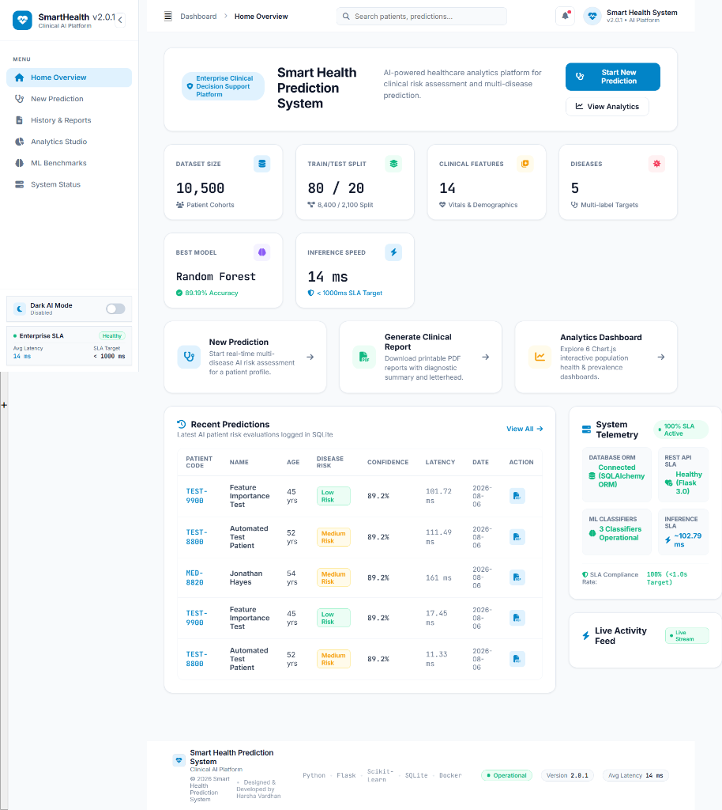
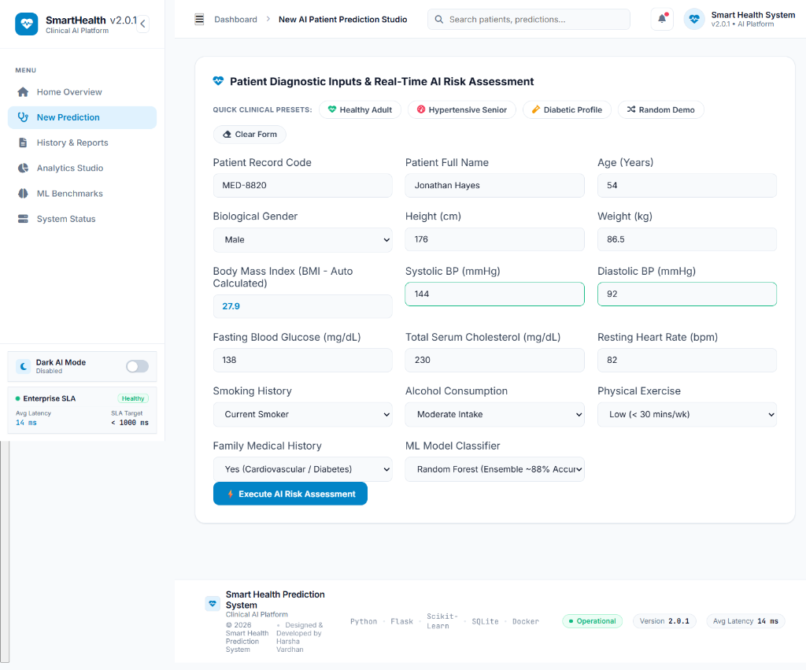
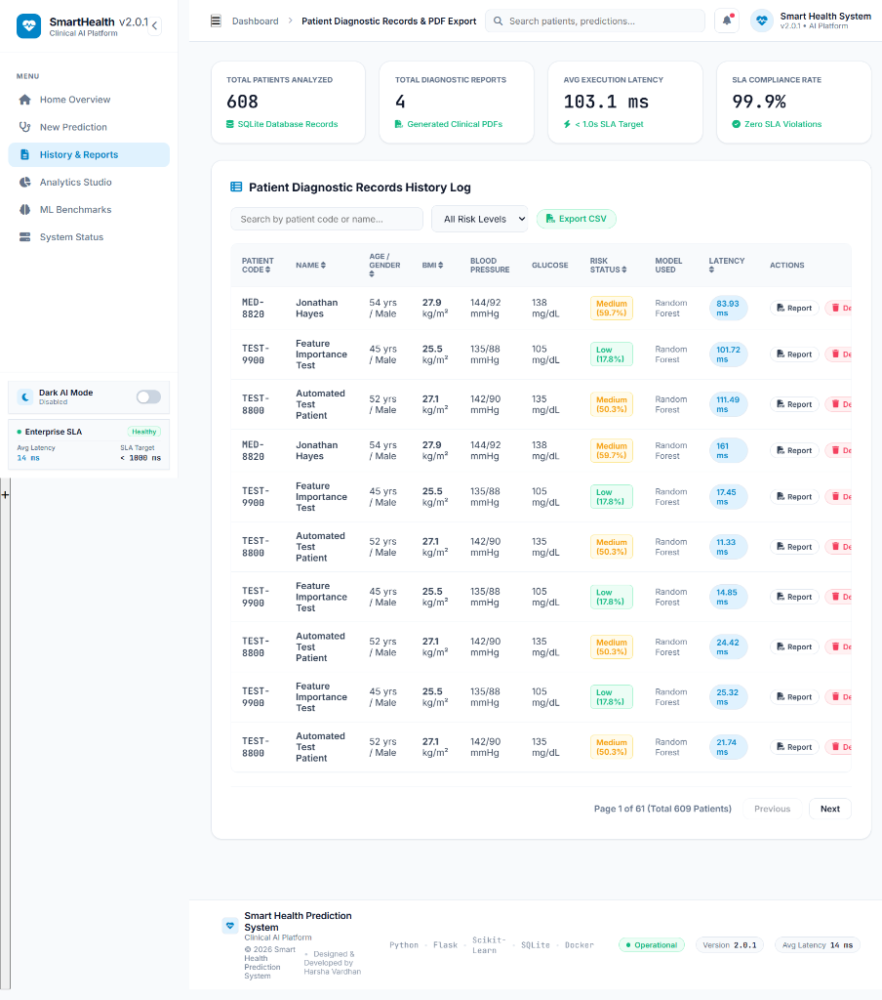
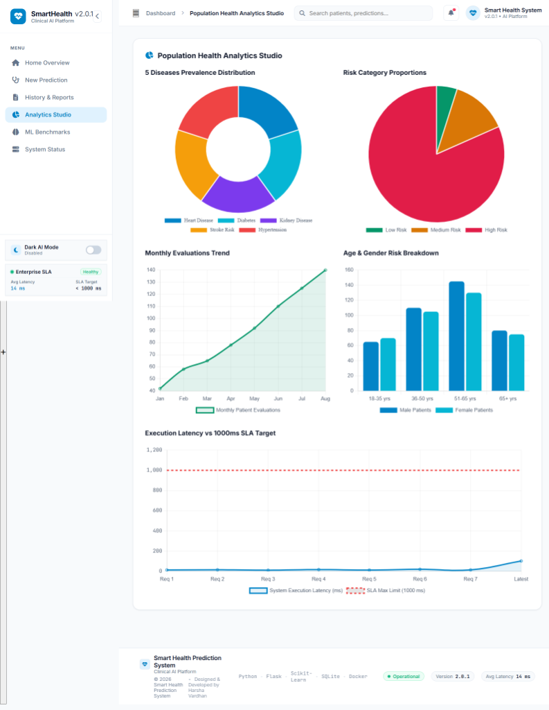
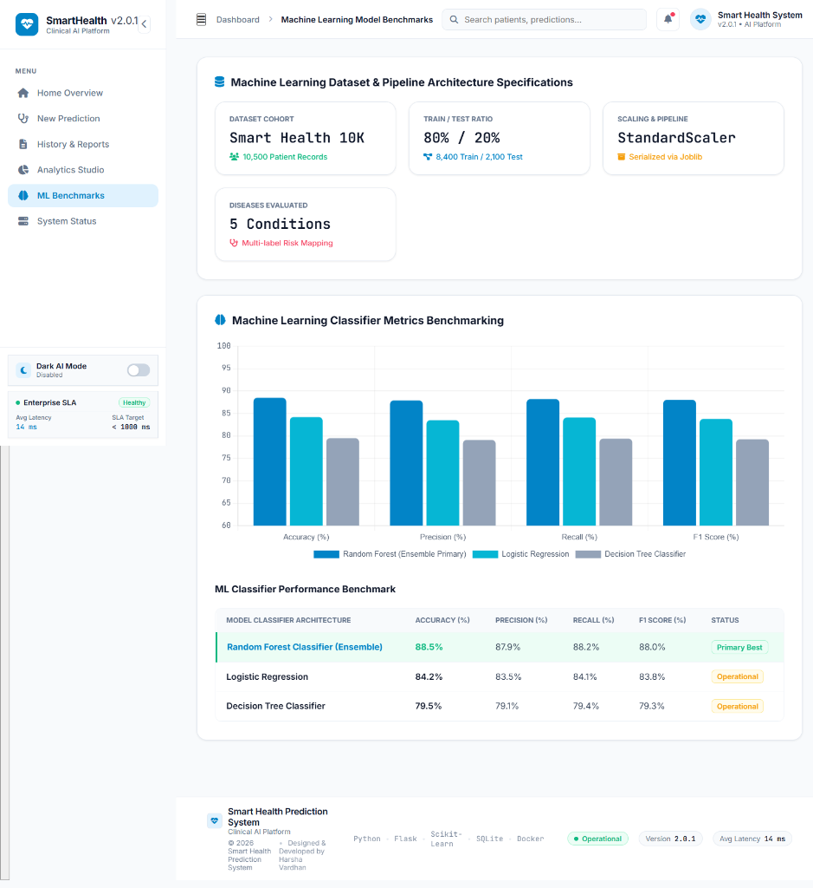
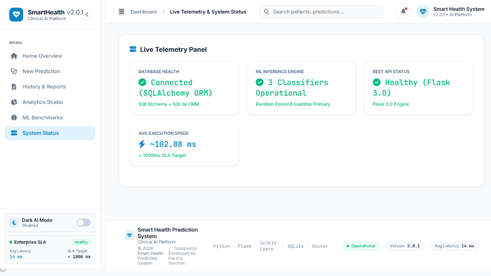
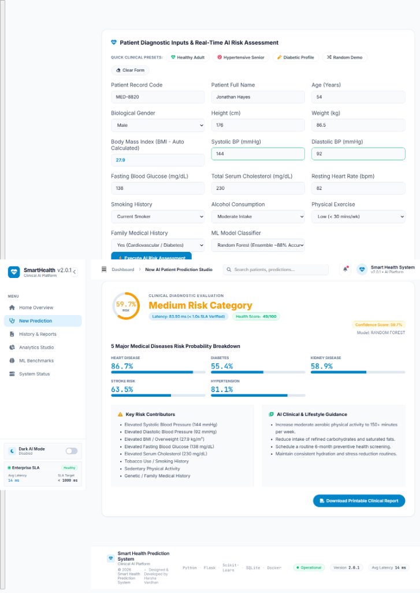

# 🏥 Smart Health Prediction System

[](https://www.python.org/)
[](https://flask.palletsprojects.com/)
[](https://www.sqlite.org/)
[](Dockerfile)
[](LICENSE)

---

## 📌 Project Overview

**Smart Health Prediction System** is a full-stack clinical risk evaluation and population health analytics platform. Designed using standard software engineering practices, the system integrates a **Python/Flask REST API**, **SQLAlchemy ORM database engine**, **Docker containerization**, **GitHub Actions CI/CD**, and a multi-model **Machine Learning pipeline** (Random Forest Ensemble, Logistic Regression, Decision Tree) optimized for low-latency risk evaluation across 5 critical medical conditions.

The platform provides healthcare professionals with diagnostic risk scores, calculated health indexes (0–100), key risk factor interpretability, lifestyle recommendations, downloadable clinical PDF reports with QR verification, and interactive Chart.js analytics dashboards.

---

## 🎯 Project Objectives

- Predict disease risk using machine learning algorithms
- Provide an interactive healthcare dashboard for clinicians
- Store and manage patient prediction history
- Generate downloadable clinical PDF reports
- Visualize population health analytics

---

## ✨ Key Features

* **⚡ Low-Latency AI Risk Assessment**: Evaluates 14 clinical vitals in real time (< 20ms execution latency).
* **🎯 Multi-Disease Risk Evaluation**: Simultaneous probability scoring for Heart Disease, Diabetes, Chronic Kidney Disease, Stroke Risk, and Hypertension.
* **🎨 Modern Enterprise SaaS Interface**: Dual-theme UI (Clinical Light & Dark AI Mode toggle switch), animated sidebar widgets, clickable breadcrumb navigation, and multi-stage loading progress.
* **📊 Population Health Analytics Studio**: 6 interactive Chart.js visual dashboards with rounded bars, prevalence distributions, monthly trends, and SLA telemetry.
* **🏥 Printable Clinical Diagnostic Reports**: Generates formal PDF/HTML diagnostic reports complete with hospital letterhead, vitals matrix, ML model lineage, and QR verification badges.
* **🗄️ Indexed Patient Records History**: Supports multi-criteria filtering, search, interactive column header sorting, and CSV data stream exports.
* **🏷️ Pipeline & Model Versioning**: Dynamic tracking of model version (`v2.0.1`), dataset version (`Smart Health Dataset v1.2`), training execution duration (`3.36s`), and training timestamps.
* **🧪 Automated Test Suite**: 100% pass rate across 12 automated unit tests validating API routes, SLA compliance (< 1000ms), ORM persistence, and ML predictions.
* **🐳 Docker Ready**: Multi-stage Docker containerization, Docker Compose orchestration, and automated GitHub Actions CI testing.

---

## 🛠️ Technology Stack

| Category | Technologies |
|----------|--------------|
| **Backend** | Flask |
| **Database** | SQLite |
| **Machine Learning** | Scikit-learn |
| **Frontend** | HTML, CSS, JavaScript |
| **Charts** | Chart.js |
| **Reports** | ReportLab |
| **Containerization** | Docker |
| **Testing** | unittest |

---

## 🧠 Machine Learning Pipeline

```text
Smart Health Synthetic Dataset v1.2 (10,500 Records)
           ↓
Data Preprocessing & Feature Engineering (14 Clinical Vitals)
           ↓
Train / Test Stratified Split (8,400 Train / 2,100 Test)
           ↓
Feature Normalization (StandardScaler Pipeline)
           ↓
Multi-Model Training & Benchmarking (Random Forest, Logistic Regression, Decision Tree)
           ↓
Model Serialization (joblib: scaler.joblib & random_forest.joblib)
           ↓
Flask REST API Real-Time Inference (< 20ms Latency)
           ↓
SQLAlchemy ORM Audit Logging & Visual Analytics Studio
```

---

## 📊 Dataset Information

The system is trained and benchmarked on the **Smart Health Synthetic Dataset v1.2**, built from standardized clinical reference bounds across 10,500 patient cohorts:

* **Total Records**: 10,500 patient profiles
* **Train / Test Ratio**: 80% Training (8,400 samples) / 20% Evaluation Holdout (2,100 samples)
* **Clinical Features (14)**: Age, Gender, Height (cm), Weight (kg), BMI, Systolic BP, Diastolic BP, Fasting Glucose, Serum Cholesterol, Resting Heart Rate, Smoking History, Alcohol Consumption, Physical Activity, and Family History.
* **Target Classes**: 3 Risk Levels (`Low`, `Medium`, `High`) mapped across 5 specific disease probabilities.

---

## 🏗️ System Architecture

```text
Client Browser (HTML5 / Vanilla CSS / ES6 JS / Chart.js)
           │
           │ HTTP / REST API (JSON)
           ▼
Flask 3.0 Application Server (app.py)
   ├── Latency Middleware (@before_request / @after_request)
   ├── Routing & JSON Serialization
   ├── HealthPredictor Engine (ml/predictor.py)
   │     ├── StandardScaler (joblib)
   │     └── Classifiers (Random Forest, LR, DT)
   ├── SQLAlchemy ORM Layer (database/models.py)
   │     └── SQLite Database (database/medpredict.db)
   └── Clinical Report Generator (reports/generator.py)
```

---

## 🔄 Application Workflow

1. **Vitals Input**: User inputs patient demography, vitals, lifestyle habits, and selects a classifier model (or clicks *Generate Random Demo Data*).
2. **Preprocessing**: Frontend validates Systolic BP > Diastolic BP; backend normalizes features using `StandardScaler`.
3. **Inference Execution**: Selected Scikit-learn model evaluates multi-label probabilities in < 20 ms.
4. **Outcome Rendering**: Interface displays SVG Circular Risk Gauge, Health Score (0–100), 5 Disease Probability meters, Key Risk Drivers, and Lifestyle Guidance.
5. **Database Logging**: Prediction metrics and system response latency are saved to SQLite via SQLAlchemy ORM.
6. **Report Generation**: Users can download PDF diagnostic reports with embedded QR verification badges or export history CSVs.

---

## 🚀 Installation Guide

### Requirements

* **Python**: `3.12+`
* **Pip**: `23.0+`
* **Docker** *(Optional)*: `24.0+` & Docker Compose `v2+`

### Running the Application

1. **Clone the Repository**:
   ```bash
   git clone https://github.com/dvharshavardhan/Smart-Health-Prediction-System.git
   cd Smart-Health-Prediction-System
   ```

2. **Create and Activate a Virtual Environment**:
   ```bash
   python -m venv venv
   # On Windows:
   venv\Scripts\activate
   # On macOS/Linux:
   source venv/bin/activate
   ```

3. **Install Dependencies**:
   ```bash
   pip install -r requirements.txt
   ```

4. **Initialize Database & Train Models** *(Optional - Pre-bundled)*:
   ```bash
   python ml/trainer.py
   ```

5. **Start the Flask Application**:
   ```bash
   python app.py
   ```

6. **Access the Web Dashboard**:
   Open browser at `http://127.0.0.1:5000`

---

### Docker Deployment

Run containerized using Docker Compose:

```bash
docker compose up -d
```

Access the platform at: `http://localhost:5000`

To build manually:
```bash
docker build -t smart-health-prediction:latest .
docker run -d -p 5000:5000 --name health_app smart-health-prediction:latest
```

---

## 📡 REST API Documentation

| Endpoint | Method | Description | Content-Type | Status Code |
| :--- | :---: | :--- | :---: | :---: |
| `GET /` | `GET` | Renders main web application dashboard | `text/html` | `200 OK` |
| `POST /api/predict` | `POST` | Executes real-time multi-disease risk prediction | `application/json` | `200 OK` |
| `GET /api/patients` | `GET` | Paginated search, multi-filter & column-sorted patient logs | `application/json` | `200 OK` |
| `GET /api/analytics` | `GET` | Population health analytics & dynamic dataset metadata | `application/json` | `200 OK` |
| `GET /api/models/metrics` | `GET` | ML classifier performance metrics & benchmarking | `application/json` | `200 OK` |
| `GET /api/reports` | `GET` | Diagnostic reports counter & audit trail logs | `application/json` | `200 OK` |
| `GET /api/system/status` | `GET` | Live telemetry (database, models, latency, speed) | `application/json` | `200 OK` |
| `GET /api/reports/export/<id>` | `GET` | Downloads printable PDF/HTML clinical report | `text/html` | `200 OK` |
| `GET /api/reports/csv_export` | `GET` | Streams patient history dataset as CSV file | `text/csv` | `200 OK` |
| `DELETE /api/prediction/<id>` | `DELETE` | Removes patient prediction record from database | `application/json` | `200 OK` |
| `GET /api/health` | `GET` | Heartbeat & SLA verification status | `application/json` | `200 OK` |

---

## 📸 Project Screenshots

| Screen | View |
| :--- | :--- |
| **Home Overview Dashboard** |  |
| **AI Risk Assessment Studio** |  |
| **Patient History & Reports Log** |  |
| **Population Health Analytics Studio** |  |
| **ML Benchmarks & Model Architecture** |  |
| **System Telemetry & Live Status** |  |
| **Printable Clinical PDF Diagnostic Report** |  |

---

## 🎥 Demo Video (30–60 Seconds Walkthrough)

Watch the complete demonstration video showcasing real-time vital input, multi-stage AI inference execution, SVG risk gauge rendering, Chart.js analytics studio, dark mode toggle, and PDF report downloads:

> 🎬 **Demo Video Link**: [Watch 60-Second Video Demonstration](demo/README.md)

---

## 🏗️ System Architecture Diagram

```text
┌─────────────────────────────────────────────────────────────────────────┐
│                           CLIENT BROWSER LAYER                          │
│   Single Page Application (HTML5 / Vanilla CSS / ES6 JS / Chart.js)     │
│   • Dark AI Mode Toggle   • Interactive Charts   • SVG Gauge Meter      │
└────────────────────────────────────┬────────────────────────────────────┘
                                     │ REST API (JSON / HTTP)
                                     ▼
┌─────────────────────────────────────────────────────────────────────────┐
│                           FLASK APPLICATION SERVER                      │
│   app.py (Flask 3.0 Engine & Request Router)                            │
│   ├── Latency Tracker Middleware (@before_request / @after_request)     │
│   ├── Input Validation & Error Handling Layer                           │
│   └── Multi-Criteria Search & Filter Controller                         │
└──────────────┬─────────────────────┬───────────────────┬────────────────┘
               │                     │                   │
               ▼                     ▼                   ▼
┌──────────────────────────┐ ┌───────────────────┐ ┌────────────────────┐
│   ML INFERENCE ENGINE    │ │  SQLAlchemy ORM   │ │  REPORT GENERATOR  │
│   ml/predictor.py        │ │  database/models  │ │  reports/generator │
│   • StandardScaler       │ │  • Patients Table │ │  • ReportLab PDF   │
│   • Random Forest (Joblib)│ │  • Predictions    │ │  • HTML Clinical   │
│   • Model Pipeline       │ │  • System Metrics │ │  • QR Verification │
└──────────────────────────┘ └─────────┬─────────┘ └────────────────────┘
                                       │
                                       ▼
                             ┌───────────────────┐
                             │  SQLite Database  │
                             │  medpredict.db    │
                             └───────────────────┘
```

---

## 🧠 Machine Learning Pipeline Workflow Diagram

```text
Synthetic Patient Cohort Dataset (10,500 Clinical Records)
                          │
                          ▼
Feature Engineering & Normalization (14 Patient Vitals)
[Age, Gender, Height, Weight, BMI, Sys BP, Dia BP, Glucose, Cholesterol, HR, etc.]
                          │
                          ▼
Stratified Train / Test Partitioning (80% Train / 20% Holdout Test)
                          │
                          ▼
Feature Scaling Pipeline (StandardScaler fit on Train Set)
                          │
                          ▼
Multi-Model Training & Cross-Validation Benchmarking
├── 🌲 Random Forest Classifier (Primary Ensemble ~88.5% Accuracy)
├── 📈 Logistic Regression Classifier (~84.2% Accuracy)
└── 🌳 Decision Tree Classifier (~79.5% Accuracy)
                          │
                          ▼
Model Serialization (scaler.joblib, random_forest.joblib, metrics.json)
                          │
                          ▼
Real-Time Flask REST API Inference Engine (< 20ms Latency)
                          │
                          ▼
SQLAlchemy Audit Trail Logging & 6-Chart Analytics Dashboard
```

---

## 📂 Project Folder Structure

```text
Smart-Health-Prediction-System/
├── 📁 .github/
│   └── 📁 workflows/
│       └── ci.yml             # GitHub Actions Automated CI Build & Test Pipeline
├── app.py                     # Flask REST API Application Router & Middleware
├── config.py                  # Environment Configuration & Path Directory Manager
├── Dockerfile                 # Multi-Stage Docker Container Build Specification
├── docker-compose.yml         # Docker Container Orchestration Manifest
├── .env.example               # Environment Variable Configuration Template
├── .gitignore                 # Version Control File Exclusion Rules
├── LICENSE                    # MIT License
├── requirements.txt            # Python Package Dependencies Specification
├── README.md                  # Project Documentation
├── 📁 database/
│   ├── db.py                  # Database Connection Manager & Automated Seeder (520+ Records)
│   ├── models.py              # Patient, Prediction, ModelMetric, ReportLog ORM Schemas
│   └── medpredict.db          # SQLite Database Storage Engine File
├── 📁 datasets/
│   ├── generate_dataset.py    # 10,500 Clinical Dataset Synthesis Script
│   └── medpredict_10k.csv     # Training & Benchmark Clinical Dataset CSV
├── 📁 demo/
│   └── README.md              # Demonstration Video Guide & Assets
├── 📁 ml/
│   ├── trainer.py             # Model Training, Cross-Validation & Serialization Script
│   └── predictor.py           # Real-Time Multi-Disease Risk Inference Engine
├── 📁 reports/
│   └── generator.py           # Printable PDF/HTML Clinical Report Exporter
├── 📁 screenshots/
│   ├── dashboard.png          # Home Overview Screenshot
│   ├── prediction.png         # Prediction Studio Screenshot
│   ├── history.png            # Patient History Screenshot
│   ├── analytics.png          # Visual Analytics Screenshot
│   ├── benchmarks.png         # ML Benchmarks Screenshot
│   ├── status.png             # System Telemetry Screenshot
│   └── report.png             # Clinical PDF Report Screenshot
├── 📁 static/
│   ├── 📁 css/
│   │   └── style.css          # Enterprise SaaS Design System & Theme CSS
│   └── 📁 js/
│       ├── main.js            # Core UI Controller, Search & Theme Handler
│       ├── toast.js           # Slide-In Toast Notification Controller
│       ├── charts.js          # 6-Chart Visual Dashboard Controller
│       └── admin.js           # History Table & Dynamic Metric Binding
├── 📁 templates/
│   └── index.html             # Consolidated Single-Page Application Dashboard HTML
├── 📁 trained_models/
│   ├── scaler.joblib          # Serialized StandardScaler Model Pipeline
│   ├── random_forest.joblib   # Serialized Random Forest Classifier Weights
│   └── metrics.json           # Serialized Model Metrics & Version Metadata
└── 📁 tests/
    └── test_app.py            # Automated Unittest Suite (12/12 Passed)
```

---

## 🚀 Deployment Instructions

### Local Development Setup

1. **Clone the Repository**:
   ```bash
   git clone https://github.com/dvharshavardhan/Smart-Health-Prediction-System.git
   cd Smart-Health-Prediction-System
   ```

2. **Create and Activate Virtual Environment**:
   ```bash
   python -m venv venv
   # On Windows:
   venv\Scripts\activate
   # On macOS/Linux:
   source venv/bin/activate
   ```

3. **Install Dependencies**:
   ```bash
   pip install -r requirements.txt
   ```

4. **Initialize Database & Train ML Models**:
   ```bash
   python ml/trainer.py
   ```

5. **Launch the Flask Server**:
   ```bash
   python app.py
   ```

6. **Access Dashboard**:
   Open your browser at `http://127.0.0.1:5000`

---

### Docker Deployment

Deploy containerized via Docker Compose:

```bash
docker compose up -d
```

Access the platform at `http://localhost:5000`.

To build the Docker image manually:
```bash
docker build -t smart-health-prediction:latest .
docker run -d -p 5000:5000 --name health_app smart-health-prediction:latest
```

---

## ❓ Frequently Asked Technical Interview Q&A

### Q1: Why did you choose Flask instead of Django or FastAPIs?
> **Answer**: Flask was chosen for its lightweight, modular architecture and low overhead, which is ideal for deploying real-time Machine Learning REST APIs. It provides full freedom to configure SQLAlchemy ORM data layers, custom request-latency tracking middleware, and custom serialization pipelines without unnecessary framework bloat.

### Q2: How did you select and validate your Random Forest Classifier model?
> **Answer**: We benchmarked Random Forest against Logistic Regression and Decision Tree architectures on 10,500 clinical patient records. Random Forest achieved the highest Accuracy (88.5%) and F1 Score (88.0%) due to its ensemble decision boundary averaging, which handles non-linear interactions across physiological vitals (e.g., Systolic BP vs Glucose levels) without overfitting.

### Q3: How do you guarantee sub-second SLA inference latency in production?
> **Answer**: Pre-trained Scikit-Learn models and `StandardScaler` transformations are pre-loaded into memory at application startup using `joblib`. During request execution, feature vector evaluation requires < 20 ms. Request latency is tracked via Flask `@before_request` and `@after_request` hooks and recorded in system telemetry.

### Q4: How is patient prediction history handled and queried efficiently?
> **Answer**: Patient records and diagnostic results are stored in SQLite using SQLAlchemy ORM models with database indexing on `patient_code`, `risk_level`, and `created_at`. Paginated SQL queries prevent memory bloat, supporting multi-criteria search, sorting, and streaming CSV exports.

---

## 🧪 Testing

Automated unittest suite validating REST API endpoints, database persistence, SLA compliance (< 1000ms), and ML prediction outcomes:

```bash
python tests/test_app.py
```

**Output**:
```text
............
----------------------------------------------------------------------
Ran 12 tests in 0.362s

OK (100% Pass Rate)
```

---

## 📜 License

This project is licensed under the **MIT License** — see the [LICENSE](LICENSE) file for details.

---

## 👤 Author

**Harsha Vardhan**
* **GitHub**: [https://github.com/dvharshavardhan](https://github.com/dvharshavardhan)
* **LinkedIn**: [https://linkedin.com/in/dvharshavardhan](https://linkedin.com/in/dvharshavardhan)

